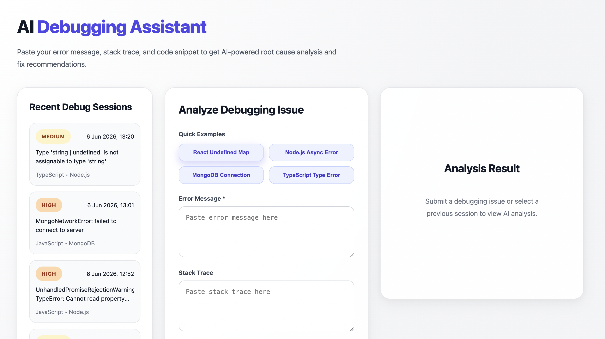
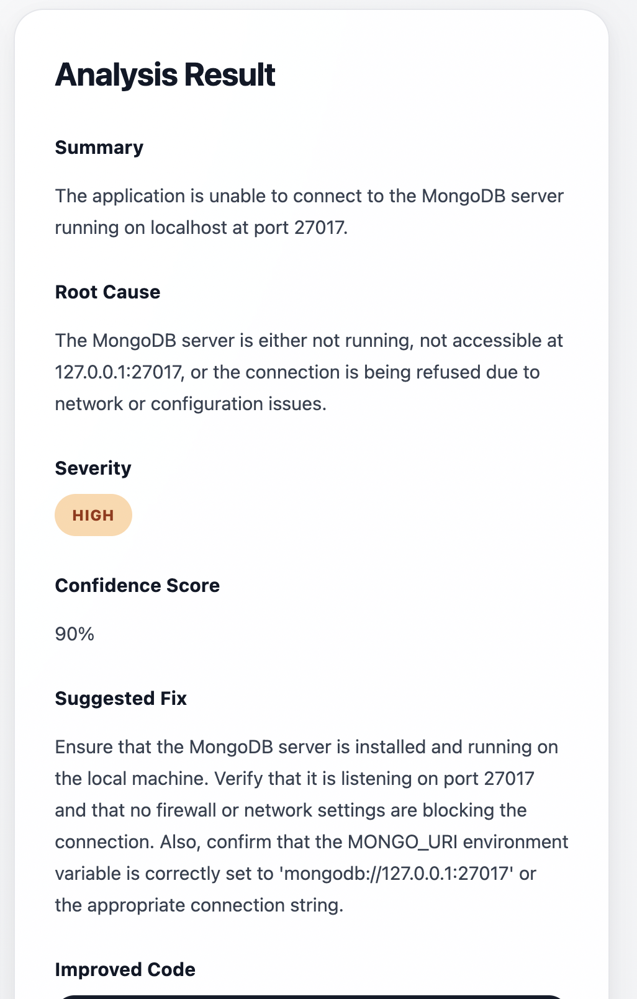
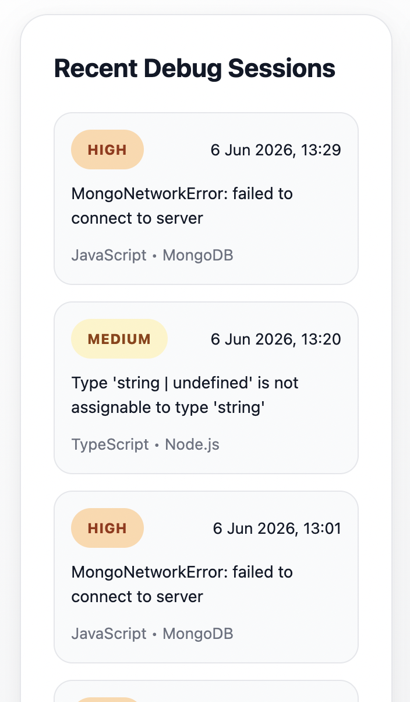

# AI Debugging Assistant

An AI-powered debugging assistant built with Node.js, TypeScript, React, and OpenAI.

The application analyzes programming errors, stack traces, and code snippets to identify probable root causes, suggest fixes, and recommend preventive improvements.

---

## Preview



### AI Analysis



### Debug History



## Features

- AI-powered debugging analysis
- Root cause identification
- Severity classification
- Confidence scoring
- Suggested fixes
- Improved code recommendations
- Persistent debugging history
- PostgreSQL + Prisma integration
- Reload previous analyses
- Multiple built-in debugging examples

## Architecture

```text
React
   ↓
Express API
   ↓
OpenAI
   ↓
Prisma ORM
   ↓
PostgreSQL (Neon)
```

---

## Tech Stack

### Frontend

- React
- TypeScript
- Vite
- Axios

### Backend

- Node.js
- Express.js
- TypeScript
- OpenAI API
- Zod

---

## Project Structure

```txt
ai-debugging-assistant/
  backend/
  frontend/
```
